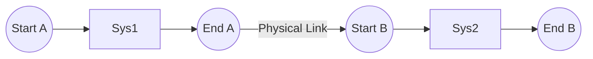

# Elysia ECS Scheduling & Timing Deep Dive (Scheduling)

Elysia's scheduler is not just a task executor; it is a **topology compiler**. It translates your logical intentions into an extremely parallelized physical pipeline.

> **📌 This document describes the core library scheduler** (`ElysiaECS/src/schedule/v2/scheduler_v2.cppm`)

---

## 1. Stage Division (Stages)

The core library divides the program's lifecycle into two stages:

### Startup Stage (Runs Only Once)
- Executes once before the main loop
- Used for initializing resources, genesis entities, etc.
```cpp
app.add_startup_system("Init", [](World& w) {
    w.resources().add(GlobalConfig{.gravity = 9.8f});
});
```

### Main Stage (Frame Loop)
- Executes every frame, scheduling all registered systems
- Achieves parallel execution via DAG (Directed Acyclic Graph) topological sorting
```cpp
app.system("Move").run([](Pos& p, const Vel& v) {
    p.x += v.dx;
}).build();
```

---

## 2. Logical Orchestration: `chain` and `Sync`

`chain` is the ultimate decree for establishing timing relationships. It ensures order using **Sentinel Nodes** technology.

### A. Set Chains
```cpp
// 🌸 Establish a physical chain: Set A -> Sync Point -> Set B
scheduler.chain("Loader", Sync, "Solver");
```
- **Loader**: Transforms into `SetStart_Loader` and `SetEnd_Loader`.
- **Sync**: Inserts a strictly exclusive synchronization barrier.
- **Effect**: All systems mounted under "Loader" will physically execute strictly before those under "Solver".

---

## 3. The Sentinel Secret

Why are Elysia's Set dependencies so robust?

1.  **Interval Locking**: When you add system $S$ to `Set A`, the scheduler automatically creates $SetStart_A \to S$ and $S \to SetEnd_A$.
2.  **Pull Effect**: When you declare `Set B after Set A`, the scheduler creates an edge: $SetEnd_A \to SetStart_B$.
3.  **Result**: Even with 1,000 systems, as long as they belong to ordered Sets, the topological sort yields perfect, expected execution waves.



---

## 4. The Art of Modularity: Plugin Pattern

Do not pile systems into the `main` function. Use `Plugin`s to implement self-contained business modules.

```cpp
struct MyPhysicsPlugin {
    static void build(App& app) {
        auto& world = app.world();
        // 1. Initialize module-private resources
        world.resources().get_or_create<PhysicsWorld>();

        // 2. Core Library API: Get the scheduler via scheduler()
        auto& sched = app.scheduler();
        sched.system("Integrate").run(compute_physics).build();
        
        // Fleet Extension API (Multi-Stage):
        // auto& sched = app.scheduler(MainStage::Update);
        // sched.add_system("Integrate", compute_physics);
    }
};
```

---

## 💡 Performance Tips (Optimization)

1.  **Minimize Syncs**: Each `Sync` forces CPU cores to halt and wait for the main thread to submit commands. If two systems have no "structural dependencies" (i.e., they don't add/remove components), try to remove the Sync between them.
2.  **Utilize Exclusive Mode**: If a system must modify the entire World's topology, declare it as `.exclusive()`. It will automatically become an implicit synchronization point.
3.  **Late Binding**: Heavily utilize string Symbols to reference systems and Sets. This allows you to construct complex dependency webs regardless of Plugin loading order.
