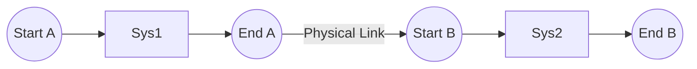

# Elysia ECS 调度与时序深度解析 (Scheduling)

Elysia 的调度器不仅是任务执行器，更是一个**拓扑编译器**。它将你的逻辑意图转化为极致并行的物理流水线。

> **📌 本文档描述核心库调度器**（`ElysiaECS/src/schedule/v2/scheduler_v2.cppm`）

---

## 1. 阶段划分 (Stages)

核心库将程序的生命周期分为两个阶段：

### Startup 阶段 (仅运行一次)
- 在 main 循环之前执行一次
- 用于初始化资源、创世实体等
```cpp
app.add_startup_system("Init", [](World& w) {
    w.resources().add(GlobalConfig{.gravity = 9.8f});
});
```

### Main 阶段 (帧循环)
- 每帧执行，所有注册的系统在此调度
- 通过 DAG 拓扑排序实现并行执行
```cpp
app.system("Move").run([](Pos& p, const Vel& v) {
    p.x += v.dx;
}).build();
```

---

## 2. 逻辑编排：`chain` 与 `Sync`

`chain` 是构建时序关系的“圣旨”。它通过 **哨兵节点 (Sentinels)** 技术确保顺序。

### A. 集合链条
```cpp
// 🌸 建立 Set A -> 同步点 -> Set B 的物理链条
scheduler.chain("Loader", Sync, "Solver");
```
- **Loader**：变成 `SetStart_Loader` 和 `SetEnd_Loader`。
- **Sync**：插入一个具有强制排他性的同步屏障。
- **效应**：所有挂载在 "Loader" 下的系统，物理时序绝对早于 "Solver" 下的系统。

---

## 3. 哨兵节点原理 (The Sentinel Secret)

为什么 Elysia 的 Set 依赖如此稳健？

1.  **区间锁定**：当你把系统 $S$ 加入 `Set A` 时，调度器自动建立 $SetStart_A 	o S$ 和 $S 	o SetEnd_A$。
2.  **拉动效应**：当你声明 `Set B after Set A` 时，调度器建立一条边：$SetEnd_A 	o SetStart_B$。
3.  **结果**：即使你拥有 1000 个系统，只要它们归属于有序的 Set，拓扑排序就会产生完美的、符合预期的波次。



---

## 4. 模块化艺术：Plugin 模式

不要在 `main` 函数里堆砌系统。使用 `Plugin` 实现自包含的业务模块。

```cpp
struct MyPhysicsPlugin {
    static void build(App& app) {
        auto& world = app.world();
        // 1. 初始化模块私有资源
        world.resources().get_or_create<PhysicsWorld>();

        // 2. 核心库 API：通过 scheduler() 获取调度器
        auto& sched = app.scheduler();
        sched.system("Integrate").run(compute_physics).build();
        
        // Fleet 扩展 API（Multi-Stage）：
        // auto& sched = app.scheduler(MainStage::Update);
        // sched.add_system("Integrate", compute_physics);
    }
};
```

---

## 💡 性能锦囊 (Optimization)

1.  **减少 Sync 数量**：每个 `Sync` 都会强迫 CPU 核心停下来等待主线程提交命令。如果两个系统没有"结构性依赖"（即不增删组件），尽量去掉它们之间的 Sync。
2.  **利用 Exclusive 模式**：如果一个系统必须修改整个 World 的拓扑，声明它为 `.exclusive()`。它会自动变成一个隐含的同步点。
3.  **Late Binding**：尽量利用字符串 Symbol 引用系统和 Set，这允许你在 Plugin 加载顺序无关的情况下建立复杂的依赖网。
